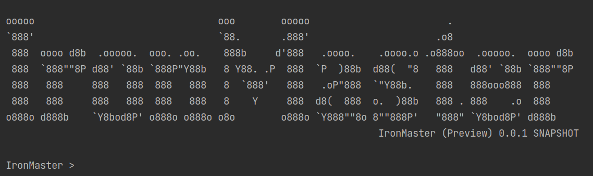

# IronMaster
A small command-line tool written using Kotlin to player run a solo [Ironsworn RPG](http://www.ironswornrpg.com) game.

 This tool is for the beginners who do not have to spend time on setup or try the game with minimum arrangements and configurations. We also plan to make it easy to guide. But its for the long run. Currently goal fo this game is to minimize the setup and fast way to handle the system. 

This tool is a command-line tool. You have to open in your command prompt/terminal, and you will be in a shell. Just by typing, you interact with the tool. 

# Preview

# Recomended
* This tool is not to replace your all-time favourite way fo playing; table-top pen-paper dice style. If you have all the setup to play, feel free to ignore this tool and continue with your real-time system.
* If you want to narrate your journey while playing, you can use your pen-paper or tools like [RoleScape.io](https://rolescape.io)

# NOTE
Currently, this tool is in development state. You can see the status on this page.

# Prerequesit
* Java Runtime 1.8

# Getting Started
* Make sure you install the above prerequisites. 
* Create your Character (This tool requires)
* Create your Assets (This tool requires)
* Create your world in mind or paper 
That's all, run the tool, and it automatically starts and ready for your commands.

# Features Added
| Features                                                 | Status           | Remarks  |
| -------------------------------------------------------- |:----------------:| --------:|
| Basic command like feature                               | `in progress`    |          |
| Reading user defined character sheet                      | `in progress`    |          |
| Action roll                                              | `not started`    |          |
| Action roll with stat and adds                           |                  |          |
| Action roll with character sheet support                 |                  |          |
| Reading Moves                                            |                  |          |
| Updating real-time character sheet                       |                  |          |
| ....more to add...                                       |                  |          |
|                                                          |                  |          |

# Credits
* This work is based on Ironsworn (found at [Ironsworn](http://www.ironswornrpg.com)), created by Shawn Tomkin, and licensed for our use under the Creative Commons Attribution-NonCommercial-ShareAlike 4.0 International license  (creativecommons.org/licenses/by-nc-sa/4.0/).

* Data Acknowledgement
** [Discordsworn](https://github.com/ribbanya/discordsworn)
** [rsek/datasworn](https://github.com/rsek/datasworn)
