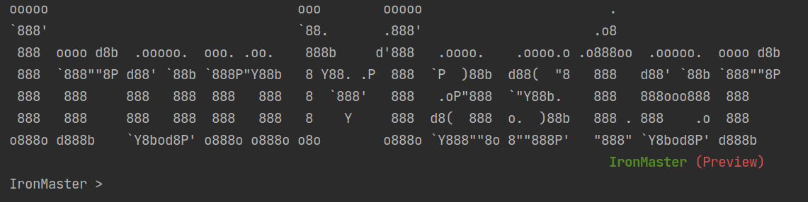

# IronMaster
A small command-line tool written using Kotlin to player run a solo [Ironsworn RPG](http://www.ironswornrpg.com) game.

We have designed this tool for the beginners or anyone who does not have to stop playing because they do not have necessary things like dice, Oracle etc. or do not want to spend too much time reading. We like to make things simple and make you get ready to play right away. All you do is to start focusing on the game and narrating your journey.

This tool is a console/command-line based interface. You have to open in your favourite terminal, do not need to worry on the look, and the program will guide you to get started.

# Preview

# Recommended
* This tool is not to replace your all-time favourite way fo playing; table-top pen-paper dice style. If you have all the setup to play, feel free to ignore this tool and continue with your real-time system.
* If you want to narrate your journey while playing, you can use your pen-paper or tools like [RoleScape.io](https://rolescape.io)

# NOTE
This project is new, and we are yet to come up with our first release. feel free to look around and share your view and feedback

# Prerequisites
* Java Runtime 1.8

# Features Added
| Features                                                 | Status           | Remarks  |
| -------------------------------------------------------- |:----------------:| --------:|
| Basic command like feature                               | `in progress`    |          |
| Reading user defined character sheet                      | `in progress`    |          |
| Action roll                                              | `not started`    |          |
| Action roll with stat and adds                           |                  |          |
| Action roll with character sheet support                 |                  |          |
| Reading Moves                                            |                  |          |
| Updating real-time character sheet                       |                  |          |
| ....more to add...                                       |                  |          |
|                                                          |                  |          |

# Credits
* This work is based on Ironsworn (found at [Ironsworn](http://www.ironswornrpg.com)), created by Shawn Tomkin, and licensed for our use under the Creative Commons Attribution-NonCommercial-ShareAlike 4.0 International license  (creativecommons.org/licenses/by-nc-sa/4.0/).
* Data Acknowledgement
  - [Discordsworn](https://github.com/ribbanya/discordsworn)
  - [rsek/datasworn](https://github.com/rsek/datasworn)
